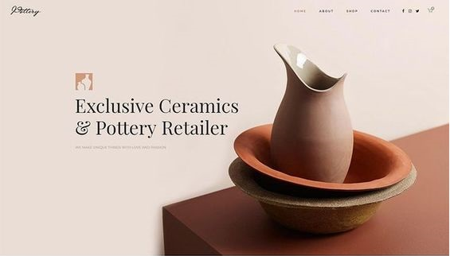

    

## 💻Projeto
Esse é um projeto Web responsivo de um site de cerâmica, que faz diversos produtos com cerâmica.

## 🖥️Tecnologias
Esse projetos foi um desafio de conhecimento básico de CSS feito por [Larrisa Azevedo](https://linktr.ee/usakimodoki?fbclid=PAAaY6kkK_QKIUCiZ6YuxssnS2-FQzx2avvLmVBwwHG4ncWONY806Vvv4l2ds), e a proposta do desafio é você fazer um layout utilizando somente HTML e CSS, mas tomei a liberdade de colocar um pouco de Javascript.

- HTML
- CSS
- JavaScript
- Git e Github

## 🏷️ Layout
Você pode visualizar o desafio através [desse link](https://github.com/LarissaAzevedo/DesafioCSs)